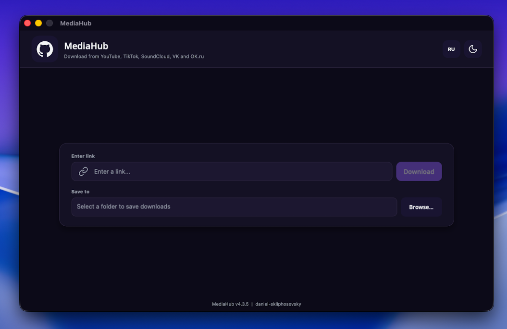
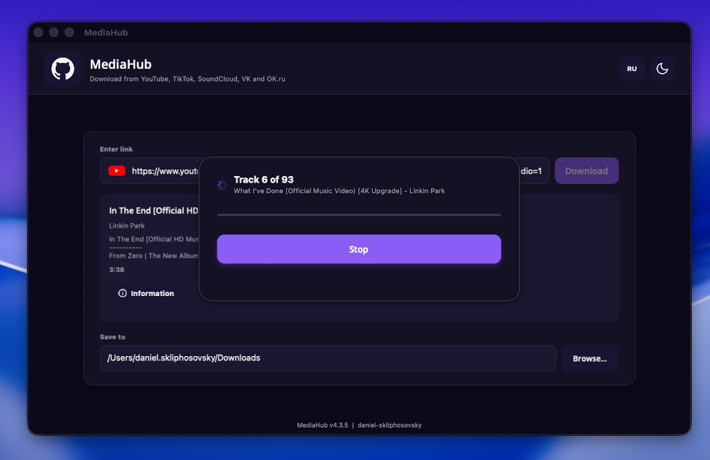
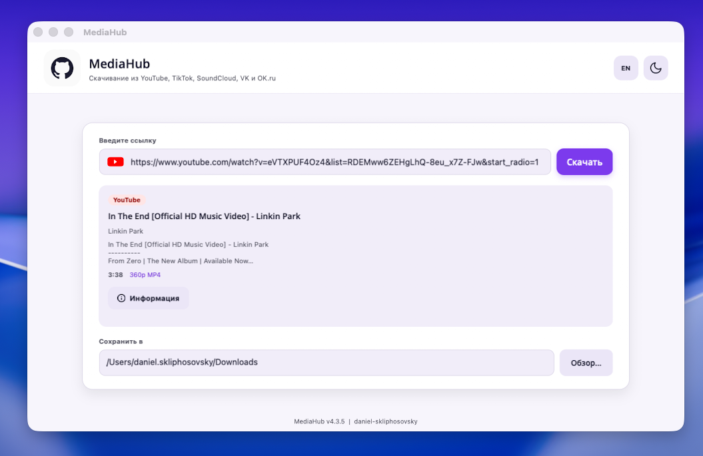
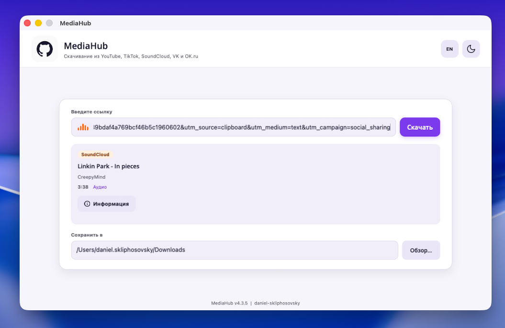
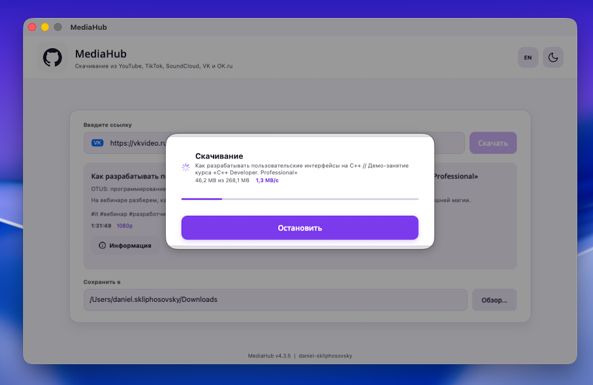

# MediaHub


[](https://github.com/daniel-skliphosovsky/MediaHub/releases)
[](https://github.com/daniel-skliphosovsky/MediaHub/blob/main/LICENSE)

MediaHub downloads media from TikTok, YouTube, SoundCloud, VK, and OK.ru. Paste a link, select a folder, and MediaHub handles the rest — automatic platform detection, media download, and progress tracking with cancel support.

## Platforms

- YouTube
- TikTok
- SoundCloud
- VK
- OK.ru

## Screenshots











## Install

### Windows

Download the latest `MediaHub.exe` from Releases and run it directly.

### macOS

Download the `MediaHub.pkg` from Releases. After download:

1. Double-click the `MediaHub.pkg` file in Finder
2. macOS will warn that the developer is not trusted
3. Go to System Settings > Privacy & Security
4. Click "Open Anyway" under "Security"
5. Authenticate with your password
6. Follow installer prompts to complete installation

### Build from source

```bash
git clone https://github.com/daniel-skliphosovsky/MediaHub.git
cd MediaHub
dotnet restore src/MediaHub.sln
dotnet build src/MediaHub.sln --configuration Release
```

**Requirements:**
- .NET SDK 9.0
- Windows 10+ or macOS 11+