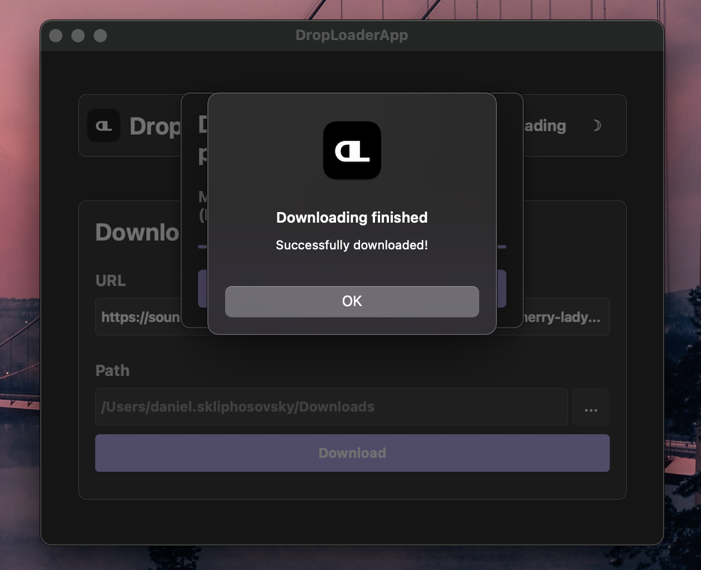
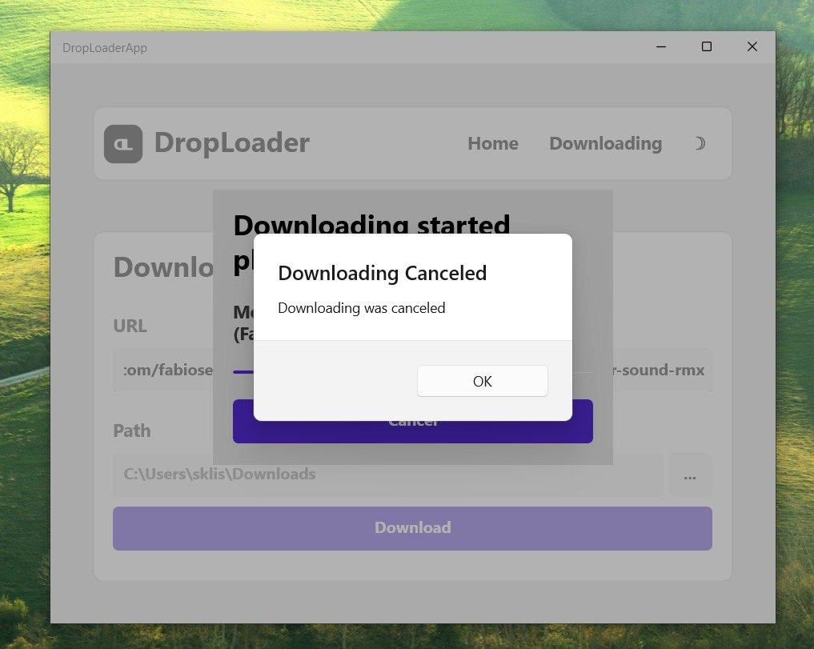

# DropLoaderApp
An application that helps you to download media from popular platforms

# Screenshots

#### Downloading Page
<table>
  <tr>
    <td></td>
    <td></td>
  </tr>
  <tr>
    <td align="center">Light Theme</td>
    <td align="center">Dark Theme</td>
  </tr>
  <tr>
    <td></td>
    <td></td>
  </tr>
</table>

#### Downloading Process
<table>
  <tr>
    <td></td>
    <td></td>
  </tr>
  <tr>
    <td align="center">Light Theme</td>
    <td align="center">Dark Theme</td>
  </tr>
  <tr>
    <td></td>
    <td></td>
  </tr>
</table>

#### Possible downloading completions
<table>
  <tr>
    <td></td>
    <td></td>
  </tr>
  <tr>
    <td align="center">Downloading Canceled</td>
    <td align="center">Downloading Finished</td>
  </tr>
  <tr>
    <td></td>
    <td></td>
  </tr>
</table>

#### Possible Errors
<table>
  <tr>
    <td></td>
    <td></td>
  </tr>
  <tr>
    <td align="center">Empty Fields</td>
    <td align="center">Incorrect Links</td>
  </tr>
  <tr>
    <td></td>
    <td></td>
  </tr>
</table>

# Usage
1. Open App
2. Go to «Downloading» Tab
3. Insert media link 
4. Select the path where the file will be saved
5. Click the «Download» Button to start downloading

# Possible Problems

**Soundcloud**: Some tracks may be unavailable and you may get a "This track is not available" error -> Solution: try to find another link to this track

**TikTok**: If the publication you provided a link to is private (or does not exist) then the program will download another random video (This is related to TikTok API). Therefore, sometimes after downloading you may find a completely different video / photo. 
Also, don't be alarmed if the download doesn't start. This is also related to TikTok API -> Solution: just wait a bit (usually up to 10 seconds) and the download will start

**YouTube**: Due to changes in YouTube policy, the program is not always able to get the audio track of the video

# Install

### Getting Started

1. **Go to Releases**  
   Download the latest version from our GitHub releases page:

   

2. **Find the latest release**  
   Look for the most recent version at the top of the releases page

3. **Follow platform-specific instructions**  
   Complete installation guides for both MacOS and Windows are available in the release description

### Platform Support

| Platform | Installation Method |
|----------|---------------------|
| Windows  | `.exe` (standard installer) |
| MacOS    | `.pkg` (macOS installer package) |

